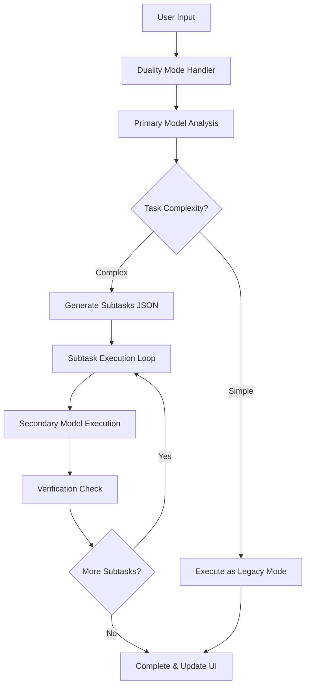

# Design Document

## Overview

The Duality mode introduces a sophisticated dual-model workflow to VSX that intelligently handles complex tasks by leveraging two AI models working in coordination. The system uses a primary model for task analysis and coordination, and a secondary model for task execution. This design ensures optimal resource utilization while providing users with granular control over complex workflows.

The architecture follows the existing VSX patterns, integrating seamlessly with the current mode system, UI components, and tool infrastructure. The implementation prioritizes minimal chat spam, visual progress tracking, and maintains the existing user experience paradigms.

## Architecture

### High-Level Flow



### Component Architecture

The Duality mode consists of several key components:

1. **Mode Handler** (`modes/duality.js`) - Main orchestration logic
2. **UI Components** - Dual model selectors and progress widgets
3. **Subtask Manager** - Handles subtask execution and verification
4. **Progress Tracker** - Visual progress indication system
5. **Legacy Mode Patch** - Terminal command confirmation fix

## Components and Interfaces

### 1. Duality Mode Handler (`modes/duality.js`)

```javascript
// Core interface matching existing mode pattern
const id = "duality";
const name = "Duality";
const tagline = "Dual Model Processing";

async function execute({ router, modelId, prompt, requestId, context, previous_chat_history }) {
  // Implementation details in tasks
}

module.exports = { id, name, execute, wrappers, tagline };
```

**Key Responsibilities:**
- Parse dual model configuration from UI
- Coordinate primary and secondary model interactions
- Manage subtask execution workflow
- Handle progress tracking and UI updates
- Integrate with existing router and tool systems

### 2. UI Model Selector Enhancement

The input area will be enhanced to support dual model selection when Duality mode is active:

```html
<!-- Enhanced model dropdown for Duality mode -->
<div id="duality-model-selectors" class="hidden">
  <div class="flex gap-4 items-center">
    <div class="flex flex-col">
      <label class="text-xs text-gray-400 mb-1">Primary Model</label>
      <div id="primary-model-dropdown" class="relative">
        <!-- Model dropdown implementation -->
      </div>
    </div>
    <div class="flex flex-col">
      <label class="text-xs text-gray-400 mb-1">Secondary Model</label>
      <div id="secondary-model-dropdown" class="relative">
        <!-- Model dropdown implementation -->
      </div>
    </div>
  </div>
</div>
```

### 3. Subtask Progress Widget

A new widget component following the existing code-widget and terminal-widget patterns:

```css
.subtask-progress-widget {
  background: #212121;
  border: 1px solid #474747;
  border-radius: 6px;
  margin: 1rem 0;
  overflow: hidden;
}

.subtask-progress-header {
  background: #2a2a2a;
  padding: 8px 12px;
  border-bottom: 1px solid #474747;
  display: flex;
  align-items: center;
  gap: 8px;
  font-size: 11px;
  color: #9aa7b2;
}

.subtask-list {
  padding: 8px 0;
}

.subtask-item {
  display: flex;
  align-items: center;
  padding: 6px 12px;
  font-size: 12px;
  color: #e6eef6;
}

.subtask-status {
  width: 16px;
  height: 16px;
  margin-right: 8px;
  display: flex;
  align-items: center;
  justify-content: center;
}
```

### 4. Subtask Data Structure

```javascript
// Primary model response format
{
  "needsSubtasks": true,
  "subtasks": [
    {
      "displayText": "Analyze project structure",
      "objectivePrompt": "Examine the codebase and identify main components...",
      "expectationResults": "Should identify key files and architecture patterns",
      "done": false
    },
    {
      "displayText": "Generate implementation plan",
      "objectivePrompt": "Based on the analysis, create a step-by-step plan...",
      "expectationResults": "Should provide actionable development steps",
      "done": false
    }
  ]
}
```

## Data Models

### DualitySession

```javascript
class DualitySession {
  constructor(requestId, primaryModelId, secondaryModelId) {
    this.requestId = requestId;
    this.primaryModelId = primaryModelId;
    this.secondaryModelId = secondaryModelId;
    this.subtasks = [];
    this.currentSubtaskIndex = 0;
    this.startTime = Date.now();
    this.status = 'analyzing'; // analyzing, executing, completed, failed
  }
  
  addSubtasks(subtasks) {
    this.subtasks = subtasks.map(task => ({
      ...task,
      status: 'pending', // pending, in_progress, completed, failed
      startTime: null,
      endTime: null,
      result: null
    }));
  }
  
  getCurrentSubtask() {
    return this.subtasks[this.currentSubtaskIndex] || null;
  }
  
  markSubtaskComplete(index, result) {
    if (this.subtasks[index]) {
      this.subtasks[index].status = 'completed';
      this.subtasks[index].endTime = Date.now();
      this.subtasks[index].result = result;
    }
  }
  
  moveToNextSubtask() {
    this.currentSubtaskIndex++;
    return this.getCurrentSubtask();
  }
  
  isComplete() {
    return this.currentSubtaskIndex >= this.subtasks.length;
  }
}
```

### SubtaskVerifier

```javascript
class SubtaskVerifier {
  static async verify(subtask, result, expectationResults) {
    // Simple verification logic based on expectation results
    // Could be enhanced with more sophisticated verification
    const verification = {
      passed: true,
      confidence: 0.8,
      notes: "Subtask completed successfully"
    };
    
    // Basic checks
    if (!result || typeof result !== 'string' || result.trim().length === 0) {
      verification.passed = false;
      verification.confidence = 0.1;
      verification.notes = "No meaningful result produced";
    }
    
    return verification;
  }
}
```

## Error Handling

### Primary Model Analysis Errors
- **Timeout**: If primary model doesn't respond within 30 seconds, fall back to legacy mode
- **Invalid JSON**: If response isn't valid JSON, treat as simple task and execute with primary model
- **Missing Fields**: If required fields are missing, log error and fall back to legacy mode

### Secondary Model Execution Errors
- **Model Unavailable**: Skip to next subtask with error note
- **Execution Timeout**: Mark subtask as failed and continue
- **Verification Failure**: Log warning but continue execution

### UI Error States
- **Model Selection**: Disable send button if either model is not selected
- **Network Issues**: Show retry options in progress widget
- **Session Recovery**: Maintain session state for page refreshes

## Testing Strategy

### Unit Tests
- **Mode Handler**: Test task analysis logic and subtask coordination
- **Session Management**: Test DualitySession class methods and state transitions
- **UI Components**: Test model selector behavior and progress widget updates
- **Verification Logic**: Test SubtaskVerifier with various input scenarios

### Integration Tests
- **End-to-End Flow**: Test complete workflow from user input to completion
- **Router Integration**: Test compatibility with existing router and tool systems
- **UI Integration**: Test seamless integration with existing webview components
- **Error Scenarios**: Test graceful degradation and error recovery

### Manual Testing Scenarios
1. **Simple Task Flow**: Verify fallback to legacy-style execution
2. **Complex Task Flow**: Verify subtask generation and execution
3. **Model Selection**: Test dual model configuration and validation
4. **Progress Tracking**: Verify visual progress updates and completion states
5. **Error Recovery**: Test behavior with network issues and model failures

## Legacy Mode Terminal Command Fix

The existing legacy mode has an issue where terminal commands execute automatically without user consent. The fix involves:

### Current Problem
```javascript
// In legacy mode, terminal commands are executed immediately
const res = await terminal(args || {});
```

### Proposed Solution
```javascript
// Add confirmation step before terminal execution
if (tool === 'terminal_command') {
  // Send confirmation request to UI
  const confirmation = await requestTerminalConfirmation(args);
  if (confirmation.approved) {
    const res = await terminal(args);
    return res;
  } else {
    return { tool: 'terminal_command', success: false, skipped: true, message: 'User declined execution' };
  }
}
```

### UI Enhancement
Add a confirmation dialog that appears when terminal commands are detected:

```javascript
// In webview-client.js
function showTerminalConfirmation(command, callback) {
  const widget = createTerminalConfirmationWidget(command);
  // Show widget and handle user response
  // Call callback with user's decision
}
```

This ensures users have explicit control over terminal command execution while maintaining the existing workflow for other tools.

## Implementation Considerations

### Performance
- **Model Switching**: Minimize overhead when switching between models
- **Progress Updates**: Use efficient DOM updates for progress tracking
- **Memory Management**: Clean up session data after completion

### User Experience
- **Visual Feedback**: Clear indication of current processing state
- **Cancellation**: Allow users to cancel long-running operations
- **Progress Persistence**: Maintain progress state during page refreshes

### Compatibility
- **Existing Tools**: Ensure all existing tools work with both models
- **Router Integration**: Maintain compatibility with current router patterns
- **Extension Points**: Design for future enhancements and customizations

### Security
- **Input Validation**: Validate all JSON responses from models
- **Command Execution**: Require explicit user consent for terminal commands
- **Session Isolation**: Ensure sessions don't interfere with each other