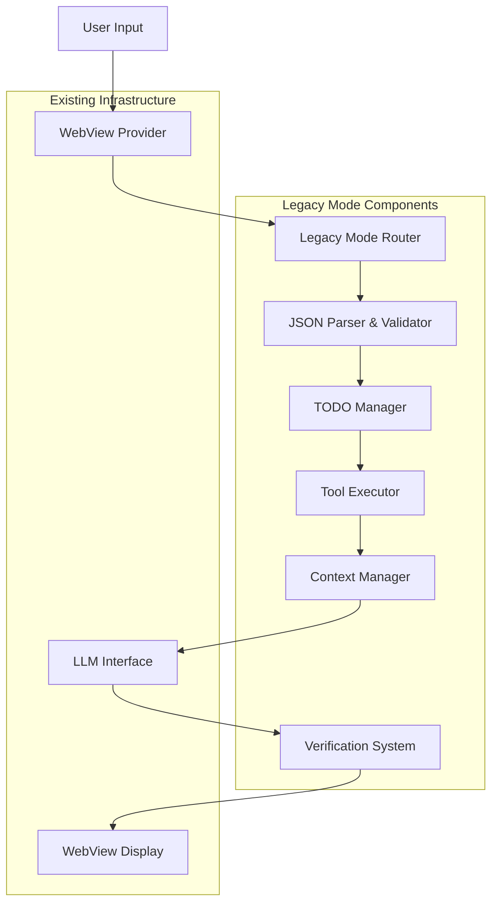

# Design Document

## Overview

The Legacy Mode Autonomous Execution feature extends the existing VSCode extension architecture to support autonomous task execution through structured JSON communication, TODO management, and comprehensive tooling integration. The system operates as a specialized mode within the existing modes framework, leveraging the current router, parser, and webview infrastructure while adding autonomous execution capabilities.

## Architecture

### High-Level Architecture



### Component Integration

The Legacy Mode integrates with the existing extension architecture:

- **Modes System**: Extends the current modes framework (`modes/index.js`) with a new `legacy.js` mode
- **Router Integration**: Leverages existing router (`route/route.js`) with Legacy Mode-specific handling
- **Parser Enhancement**: Extends current parser (`route/parser.js`) to handle structured JSON responses
- **WebView Integration**: Enhances existing webview provider with Legacy Mode UI components and handlers

## Components and Interfaces

### 1. Legacy Mode Core (`modes/legacy.js`)

**Purpose**: Main orchestrator for autonomous execution

**Key Methods**:
```javascript
async function execute({ router, modelId, prompt, requestId, context })
async function createTodoList(task, context)
async function executeTodoLoop(todos, context)
async function verifyCompletion(todos, context)
```

**JSON Response Schema**:
```json
{
  "type": "legacy_response",
  "phase": "planning|execution|verification|complete",
  "todos": [
    {
      "id": "string",
      "description": "string", 
      "expectedResult": "string",
      "status": "pending|in_progress|done|failed",
      "toolCalls": []
    }
  ],
  "toolCall": {
    "tool": "string",
    "params": {}
  },
  "verification": {
    "todoId": "string",
    "approved": "boolean",
    "feedback": "string"
  },
  "message": "string",
  "complete": "boolean"
}
```

### 2. JSON Parser & Validator (`route/legacyParser.js`)

**Purpose**: Parse and validate LLM JSON responses, handle malformed JSON gracefully

**Key Methods**:
```javascript
function parseLegacyResponse(rawResponse)
function validateJsonStructure(jsonObj)
function reconstructWithPlaceholders(jsonObj, expectedSchema)
```

**Error Handling**: 
- Validates required fields
- Provides default values for missing fields
- Logs parsing errors for debugging

### 3. TODO Manager (`legacy/todoManager.js`)

**Purpose**: Manage TODO lifecycle, status tracking, and persistence

**Key Methods**:
```javascript
function createTodo(description, expectedResult)
function updateTodoStatus(todoId, status)
function getTodoById(todoId)
function getAllTodos()
function markTodoComplete(todoId, result)
```

**TODO Data Structure**:
```javascript
{
  id: "unique-id",
  description: "Task description",
  expectedResult: "Expected outcome",
  status: "pending|in_progress|done|failed",
  createdAt: "timestamp",
  completedAt: "timestamp",
  result: "actual result",
  toolCalls: []
}
```

### 4. Tool Executor (`legacy/toolExecutor.js`)

**Purpose**: Execute various development tools and operations

**Supported Tools**:
- **File Operations**: `readFile`, `writeFile`, `createFile`, `deleteFile`
- **Search Operations**: `searchFiles`, `findInFiles`
- **Terminal Operations**: `executeCommand`, `executeTerminal`
- **VSCode Operations**: `showMessage`, `openFile`, `executeVSCodeCommand`

**Tool Interface**:
```javascript
async function executeTool(toolName, params, context)
function validateToolParams(toolName, params)
function formatToolResult(result, toolName)
```

### 5. Context Manager (`legacy/contextManager.js`)

**Purpose**: Maintain execution context across stateless LLM calls

**Context Structure**:
```javascript
{
  sessionId: "unique-session-id",
  originalTask: "initial user request",
  todos: [],
  executionLog: [],
  currentPhase: "planning|execution|verification|complete",
  startTime: "timestamp",
  modelId: "string",
  requestId: "string"
}
```

**Key Methods**:
```javascript
function createSession(task, modelId, requestId)
function updateSession(sessionId, updates)
function getSessionContext(sessionId)
function buildContextPrompt(sessionId)
```

### 6. Verification System (`legacy/verificationSystem.js`)

**Purpose**: Handle TODO completion verification and user feedback

**Key Methods**:
```javascript
async function requestVerification(todoId, result)
function handleVerificationResponse(todoId, approved, feedback)
function shouldAutoApprove(todo, result)
```

## Data Models

### Session Model
```javascript
class LegacySession {
  constructor(task, modelId, requestId) {
    this.id = generateSessionId();
    this.originalTask = task;
    this.modelId = modelId;
    this.requestId = requestId;
    this.todos = [];
    this.executionLog = [];
    this.phase = 'planning';
    this.startTime = new Date().toISOString();
    this.context = {};
  }
}
```

### TODO Model
```javascript
class LegacyTodo {
  constructor(description, expectedResult) {
    this.id = generateTodoId();
    this.description = description;
    this.expectedResult = expectedResult;
    this.status = 'pending';
    this.createdAt = new Date().toISOString();
    this.completedAt = null;
    this.result = null;
    this.toolCalls = [];
  }
}
```

### Tool Call Model
```javascript
class ToolCall {
  constructor(toolName, params) {
    this.id = generateToolCallId();
    this.toolName = toolName;
    this.params = params;
    this.result = null;
    this.success = false;
    this.timestamp = new Date().toISOString();
    this.error = null;
  }
}
```

## Error Handling

### JSON Parsing Errors
- **Malformed JSON**: Use regex patterns to extract partial data
- **Missing Fields**: Provide sensible defaults based on context
- **Invalid Structure**: Log error and request LLM to retry with correct format

### Tool Execution Errors
- **File Not Found**: Provide clear error message and suggest alternatives
- **Permission Denied**: Guide user to resolve permissions or suggest workarounds
- **Command Failed**: Capture error output and suggest debugging steps

### LLM Communication Errors
- **API Failures**: Implement retry logic with exponential backoff
- **Rate Limiting**: Queue requests and respect rate limits
- **Context Loss**: Rebuild context from session data

### User Interaction Errors
- **Verification Timeout**: Auto-approve after timeout with user notification
- **Invalid Feedback**: Request clarification from user
- **Session Interruption**: Gracefully handle session cleanup

## Testing Strategy

### Unit Tests
- **JSON Parser**: Test with various malformed JSON inputs
- **TODO Manager**: Test CRUD operations and status transitions
- **Tool Executor**: Mock tool calls and test error handling
- **Context Manager**: Test context building and session management

### Integration Tests
- **End-to-End Flow**: Test complete autonomous execution cycle
- **WebView Integration**: Test UI updates and user interactions
- **LLM Integration**: Test with mock LLM responses
- **Error Scenarios**: Test graceful degradation and recovery

### Manual Testing
- **Real Task Execution**: Test with actual development tasks
- **User Experience**: Verify UI responsiveness and clarity
- **Performance**: Monitor execution time and resource usage
- **Edge Cases**: Test with complex, ambiguous, or impossible tasks

## UI/UX Design

### Chat Display Templates

#### Legacy Mode Session Display
```html
<div class="legacy-session-item">
  <div class="session-header">
    <h2>Legacy Mode</h2>
    <span class="session-id">{{sessionId}}</span>
  </div>
  <div class="session-info">
    <span>Started: {{startTime}}</span>
    <span>Phase: {{phase}}</span>
  </div>
  <div class="session-task">{{originalTask}}</div>
  <div class="progress-bar">
    <div class="progress-fill" style="width: {{progressPercent}}%"></div>
  </div>
</div>
```

#### TODO Display Template
```html
<div class="legacy-todo-item">
  <div class="todo-header">
    <span class="todo-status">{{statusIcon}}</span>
    <h4 class="todo-description">{{description}}</h4>
    <span class="todo-id">#{{id}}</span>
  </div>
  <div class="todo-expected">Expected: {{expectedResult}}</div>
  <div class="todo-timestamps">
    Created: {{createdAt}}
    {{#if completedAt}}Completed: {{completedAt}}{{/if}}
  </div>
</div>
```

#### Tool Call Display Template
```html
<div class="legacy-tool-item">
  <div class="tool-header">
    <span class="tool-icon">🔧</span>
    <span class="tool-name">{{toolName}}</span>
  </div>
  <div class="tool-input">Input: {{params}}</div>
  <div class="tool-output">Output: {{result}}</div>
</div>
```

#### Terminal Command Template
```html
<div class="legacy-terminal-item">
  <div class="terminal-header">
    <span class="terminal-icon">💻</span>
    <span>Terminal Command</span>
  </div>
  <div class="terminal-command">$ {{command}}</div>
  <div class="terminal-output">{{output}}</div>
</div>
```

### User Interaction Flow

1. **Task Initiation**: User selects Legacy Mode and provides task description
2. **Planning Phase**: System displays TODO breakdown for user review
3. **Execution Phase**: Real-time updates show tool calls and progress
4. **Verification Phase**: User confirms TODO completion or provides feedback
5. **Completion**: Final summary with execution report and results

## Security Considerations

### File System Access
- **Sandboxing**: Restrict file operations to workspace directory
- **Permission Validation**: Check file permissions before operations
- **Path Traversal Protection**: Validate and sanitize file paths

### Command Execution
- **Whitelist Approach**: Only allow pre-approved commands
- **Parameter Sanitization**: Validate and escape command parameters
- **Execution Limits**: Implement timeouts and resource limits

### User Data Protection
- **Session Isolation**: Ensure sessions don't leak data between users
- **Sensitive Data Filtering**: Remove API keys and credentials from logs
- **Temporary File Cleanup**: Clean up temporary files after execution

## Performance Considerations

### Memory Management
- **Session Cleanup**: Implement automatic session cleanup after timeout
- **Context Size Limits**: Limit context size to prevent memory bloat
- **Efficient Data Structures**: Use appropriate data structures for performance

### Network Optimization
- **Request Batching**: Batch multiple tool calls when possible
- **Caching**: Cache frequently accessed data and results
- **Retry Logic**: Implement intelligent retry with exponential backoff

### UI Responsiveness
- **Async Operations**: Keep UI responsive during long-running operations
- **Progressive Updates**: Update UI incrementally as work progresses
- **Loading States**: Provide clear loading indicators and progress feedback