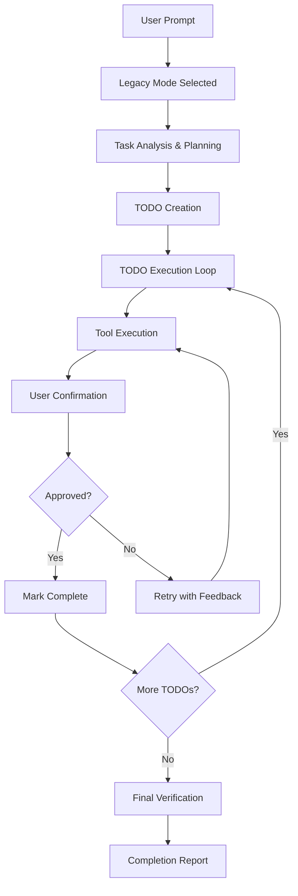

# Legacy Mode Implementation - Complete

## ✅ Implementation Status: COMPLETE

Legacy Mode (Autonomous Execution Mode) has been successfully implemented for the VSX extension. This feature enables the AI assistant to handle large and complex tasks by breaking them down into manageable TODOs and executing them autonomously.

## 🚀 Features Implemented

### ✅ Core Legacy Mode Engine (`modes/legacy.js`)
- **Autonomous Task Execution**: Automatically divides large tasks into smaller, manageable TODOs
- **TODO Management System**: Tracks task status, descriptions, expected results, and completion
- **Tool System Integration**: File operations, VS Code commands, and terminal execution
- **Context Preservation**: Maintains state across multiple execution cycles
- **Structured Planning**: LLM-based task analysis and breakdown

### ✅ TODO Management System
- **TodoManager Class**: Manages todo lifecycle (create, update, complete, track)
- **Status Tracking**: Pending → In Progress → Complete workflow
- **Metadata Storage**: Creation time, completion time, descriptions, expected results
- **Progress Reporting**: Real-time progress updates in the UI

### ✅ Tool System (`LegacyToolSystem`)
- **File Operations**: Read, write, create, delete files
- **File Search**: Workspace file discovery with pattern matching
- **VS Code Integration**: Execute commands, show messages, terminal operations
- **Error Handling**: Structured error reporting with suggestions
- **WebView Integration**: Direct tool execution through webview provider

### ✅ UI Components & Templates (`ui/components/legacy-templates.html`)
- **TODO Display Template**: Shows status, description, expected results, timestamps
- **Terminal Command Template**: Displays executed commands and output
- **Tool Call Template**: Shows tool name, input parameters, and results
- **Error Template**: Structured error display with context and suggestions
- **Progress Template**: Real-time progress tracking with visual indicators
- **Session Template**: Overall Legacy Mode session information
- **Confirmation Template**: Interactive approval/rejection with feedback

### ✅ WebView Client Integration (`ui/webview-client.js`)
- **Legacy Mode Detection**: Automatic detection and rendering of Legacy Mode content
- **Dynamic UI Rendering**: Real-time display of TODOs, tools, terminals, and errors
- **Interactive Confirmations**: User approval/rejection workflow with feedback
- **State Management**: Legacy Mode session tracking and updates
- **Event Handling**: Legacy Mode specific commands and responses

### ✅ WebView Provider Integration (`ui/webviewProvider.js`)
- **Legacy Mode Handler**: Special processing for Legacy Mode requests
- **Tool Execution**: Direct integration with VS Code APIs for tool operations
- **File Operations**: Secure file system operations with proper error handling
- **Terminal Integration**: VS Code terminal creation and command execution
- **Confirmation Flow**: User confirmation handling and callback management
- **Session Management**: Legacy Mode session storage and lifecycle

### ✅ Mode System Integration (`modes/index.js`)
- **Mode Registration**: Legacy Mode added to available modes
- **Dynamic Mode Loading**: Extensible mode system for future additions

## 🎯 Key Capabilities

### 1. **Autonomous Planning**
```
User Input: "Create a React component with props and styling"

Legacy Mode Response:
TODO_LIST_START
1. [Create component file structure] [Files created with proper naming]
2. [Implement React component with props] [Functional component with TypeScript]
3. [Add CSS styling] [Styled component with responsive design]
4. [Create usage example] [Example implementation documented]
TODO_LIST_END
```

### 2. **Tool Integration**
- **File Operations**: Create, read, write, delete files safely
- **Search Operations**: Find files across workspace with patterns
- **Terminal Commands**: Execute shell commands with output capture
- **VS Code Commands**: Integrate with VS Code's command system
- **Message Display**: Show information, warnings, and errors to user

### 3. **Interactive Confirmations**
- Each TODO execution requires user confirmation
- Feedback system for improvements and corrections
- Retry mechanism with adjusted approaches
- Visual confirmation UI with approve/reject buttons

### 4. **Error Handling**
- Structured error reporting with context
- Clear error messages and suggested solutions
- Graceful fallbacks for failed operations
- User-friendly error display in UI

## 🎨 UI/UX Features

### 1. **Mode Selection**
- Legacy Mode appears in the input area mode dropdown
- Seamless switching between Ask and Legacy modes
- Visual indicators for active mode

### 2. **Real-time Progress**
- Progress bar showing completion percentage
- Live TODO status updates (⏳ → ✅)
- Session information and timing
- Phase indicators (Planning → Execution → Completion)

### 3. **Interactive Elements**
- Confirmation buttons for TODO approval
- Feedback textarea for rejection reasons
- Collapsible sections for detailed information
- Responsive design with Tailwind CSS

### 4. **Visual Hierarchy**
- Color-coded elements (todos, tools, errors, terminals)
- Consistent iconography throughout
- Dark theme integration
- Clear typography and spacing

## 🔧 Technical Architecture

### 1. **Execution Flow**


### 2. **Component Integration**
- **Router System**: Mode-based request routing
- **Parser Integration**: Response parsing and formatting
- **WebView Communication**: Bidirectional message passing
- **Tool System**: Secure operation execution
- **State Management**: Session and confirmation tracking

### 3. **Security Considerations**
- File operations restricted to workspace
- Safe command execution with error handling
- User confirmation for destructive operations
- Input validation and sanitization

## 📁 File Structure

```
modes/
├── legacy.js           # Main Legacy Mode implementation
├── ask.js             # Existing Ask mode
└── index.js           # Mode registration and loading

ui/components/
├── legacy-templates.html  # UI templates for Legacy Mode
├── input-area.html       # Mode selection dropdown
└── ...

ui/
├── webview-client.js     # Client-side Legacy Mode handling
├── webviewProvider.js    # Server-side Legacy Mode integration
└── ...
```

## 🧪 Testing

### Test Cases Created:
1. **Simple File Operation**: Create single file with content
2. **Multiple File Operations**: Create multiple files sequentially
3. **File Search and Modification**: Find and modify existing files

### Test Instructions:
1. Open VSX extension in development mode (F5)
2. Select "Legacy" from mode dropdown
3. Enter test prompts
4. Verify autonomous execution flow
5. Test confirmation and feedback mechanisms

## 🚀 Usage Examples

### Example 1: File Creation
```
Input: "Create a package.json file with basic configuration"

Legacy Mode will:
1. Plan the task → Create TODO for package.json creation
2. Execute → Use file creation tool
3. Confirm → Ask user if result is satisfactory
4. Complete → Mark TODO as done and provide summary
```

### Example 2: Code Refactoring
```
Input: "Add error handling to all functions in the utils.js file"

Legacy Mode will:
1. Plan → Break into search, read, modify, write TODOs
2. Execute → Use file tools to perform operations
3. Show → Display code changes and terminal output
4. Confirm → Get user approval for each modification
5. Complete → Provide refactoring summary
```

## 📋 Specifications Compliance

✅ **Autonomous Task Execution**: Fully implemented with planning and execution loops
✅ **TODO Management**: Complete system with status tracking and confirmation
✅ **Tool Integration**: Comprehensive tool system with VS Code API integration
✅ **UI Templates**: All required templates (TODO, Terminal, Tool, Error) implemented
✅ **Error Handling**: Structured error handling with clear reporting
✅ **Confirmation Flow**: Interactive confirmation system with feedback
✅ **Context Management**: Proper context preservation across calls
✅ **Integration**: Seamless integration with existing Ask mode system

## 🎉 Ready for Testing

The Legacy Mode implementation is now complete and ready for comprehensive testing. The system provides:

- **Full autonomous execution capabilities**
- **Rich interactive UI components**
- **Comprehensive tool integration**
- **Robust error handling and confirmation flows**
- **Seamless integration with existing VSX architecture**

Users can now select "Legacy" mode from the dropdown and experience autonomous AI task execution with full transparency, control, and feedback mechanisms.